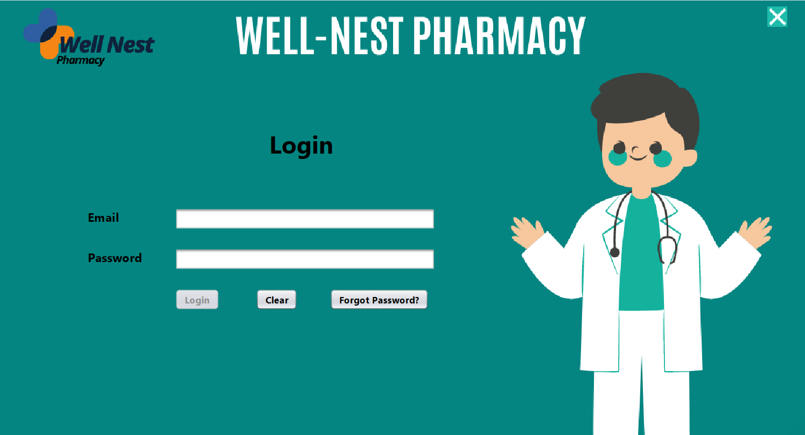

# 💊 Well Nest Pharma System

**Well Nest Pharma System** is a simple Pharmacy Management System built using **Java Swing** (NetBeans IDE) and **MySQL**. It features role-based access for Admins, Staff, and Customers, supporting basic inventory operations and secure authentication.

---

## 🚀 Features

### 🔐 Login System
- Email and password-based authentication
- Role-based access:
  - **Admin**
  - **Staff**
  - **Customer**

### 👨‍💼 Admin Dashboard
- View **Total Sales**
- **Add Staff**
- **Delete Staff**
- **Add Medicine**
- **Update Medicine**
- **Delete Medicine**

### 👨‍⚕️ Staff Dashboard
- View **Total Sales**
- **Add Medicine**
- **Delete Medicine**

### 🛍️ Customer Panel
- View medicines
- **Buy** from the store

---

## 🛠 Technologies Used

- **Java (Swing GUI)**
- **NetBeans IDE**
- **MySQL Database**
- **JDBC (Java Database Connectivity)**

---

## 📸 Screenshots

### 💻 Application Interface

